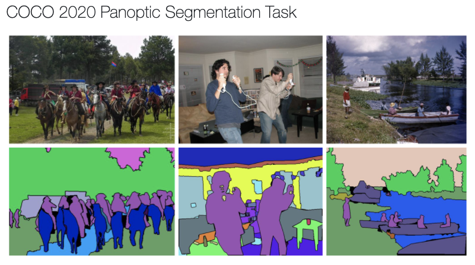
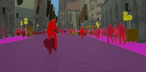

# UNetSegmentation

## 1 MSCoco Dataset

- download `2017 Train Images [118k/18GB]`, `2017 Val Images [5k/1GB]` and `2017 Train/val annotations [1.1GB]` from https://cocodataset.org/#download
- unzip the downloaded files and place them in the following structure:
  - data
    - MSCoco
      - annotations
      - train2017
      - val2017

## 2 Cityspaces Dataset

- download `gtFine_trainvaltest.zip (241MB)` https://www.cityscapes-dataset.com/file-handling/?packageID=1
- download `leftImg8bit_trainvaltest.zip (11GB)` https://www.cityscapes-dataset.com/file-handling/?packageID=3
- unzip the downloaded files and place them in the following structure:
  - data
    - CitySpaces
      - gtFine_trainvaltest
        - gtFine
          - test
          - train
          - val
        - license.txt
        - README